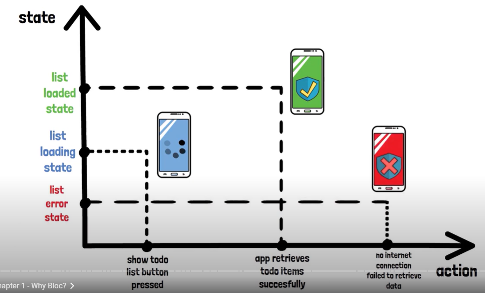

# Bloc

***Business Logic Component***
```
    States        Request
   <-------      ------->
UI          BLOC         Data Layer (Repositories, Providers, Models, Sources)
   ------->      <-------
   Events         Response

```


# Why Bloc
- Designing pattern develop by google to seperate the business logic from the  presentation layer
- as developing app we should be aware of state of our app (list loading state , Warning state , download failed state)
- 
- 
  
# Stream
Sender send the data and in the recieve end it don't know what kind of data it would recieve
1. ***The yield Keyword
The yield returns the single value to the sequence at a time but does not stop the execution of the generator function completely. It returns a value for each execution of the generator function*.**

2. Async* => Generate Async Data
3. Stream is important because we would have interaction with app so we have to listen to that request in order to emit state
4. 
5. 
   
### ***Bloc Extend Cubit***


## Cubit is a special type of stream component which is based on some function which are call from *UI* and then function are rebuild by emitting different state
- Counter App State
- 

Cubit function
1. These function are not part of a Stream
  - A function in a Cubit doesn't rely on a continuous flow of data (a stream). Instead, it performs a specific action when called, like setting a value, updating a state, or performing a calculation. It works on-demand, triggered when you explicitly call the function.
  - Clicking a button in a mobile app to toggle dark mode — the theme changes only when you click the button.
2. they are a simply pre-baked list of what the cubit can do
  - Cubit functions are predefined actions that the Cubit can perform. These actions are like a menu of available options the Cubit is capable of executing, such as incrementing a counter, toggling a boolean, or changing a value.
  - A music player app — buttons like play, pause, or skip represent specific actions the app can perform.


BLOC
- have event and state this both pass the stream of state and stream of event

###When should i use cubit as opposed by bloc

example how it would when user is searching for weather on typing 
1. **Cubit**:  
   - **Appropriate for Simpler Scenarios**: Cubit is ideal for straightforward state management where there is a direct correlation between user interactions and state changes.  
   - **Example Behavior**: When the user types `showLocationWith("LO")`, Cubit immediately emits a new state with filtered locations based on the input. It responds to each change in real time without additional processing.

2. **BLoC**:  
   - **Preferred for Complex State Management**: BLoC is better suited for scenarios requiring event-based logic, such as debouncing or managing multiple asynchronous operations.  
   - **Example Behavior**: When the user types `showLocationWith("LO")`, BLoC waits for a debounce period (e.g., 2 seconds) or for the user to stop typing before emitting a new state. This approach minimizes redundant state updates and ensures efficient processing.  

# Flutter Bloc Widget
1. Bloc Provider
   - how would we link BLOC/cubit to the flutter user Interface
   - One thing is to create bloc object into each class which require bloc state
   - One major problem with this would be use of multiple instance of same bloc in different class this would lead to a terrible state management condition
   - 
   - So to solve this issue we can use bloc provider widget which create and provide bloc to all it children down the widget tree
   - It is also called Dependency injection widget
   - Bloc provider will provide a single instance of a BLOC to a subtree below it 
   - It take BuildContext as an argument and return the `single` instance of the bloc
   - we can access the bloc in subtree by `BlocProvider.of<Bloc_name>(context)` or `context.bloc<Bloc_name>`
   - BlocProvider, the lazy parameter determines whether the Bloc or Cubit instance is created lazily (only when it is accessed) or eagerly (immediately when the widget is built).
   - By default, lazy is true, meaning the instance is created lazily. If lazy is set to false, the Bloc/Cubit is instantiated as soon as the BlocProvider is built in the widget tree.
   - When to Use Lazy or Eager Loading
      Use lazy: true (default):
         For Blocs/Cubits that are not required immediately when the widget tree is built.
         To save memory and performance overhead.
      Use lazy: false:
         For Blocs/Cubits that need to start their initialization immediately.
         When the initialization involves critical tasks like API calls or setting up listeners.
   - ***BlocProvider created the bloc so it would not forgot to close the bloc***
     - Example : suppose i have authScreen and then i move to  entirely new screen that is new get attach in the widget tree so the new create screen or subtree would not able to access the bloc 
       - `Why because there is any another new context is created`
       - so to pass the instance of the blocProvider into new context we would use `BlocProvider.value`
       - **BlocProvider.value: Does not create a new bloc instance. Instead, it reuses an existing bloc instance and ensures it is available in a new context.**
       - `BlocProvider.create`:Creates and manages the bloc lifecycle. Bloc is disposed of when the widget is removed.
       - `BlocProvider.value`: Reuses an existing bloc instance. Does not recreate or dispose of the bloc. Useful when passing bloc instances to new contexts or screens.
  
2. **BlocBuilder**  
   - A widget that helps rebuild the UI based on Bloc state changes.  
   - Requires `cubit` or `bloc` to be passed for listening to state changes.  
   - The `builder` function is a required component used to define how the UI looks for different states.  
   - Optionally uses `buildWhen` to control whether the builder function should be triggered for specific state changes.  
   - Does not perform any side effects like API calls or navigation.
   - The builder function in BlocBuilder can technically be called multiple times, but it is designed to be a pure function, meaning it should only build the UI based on the current state without causing side effects.
   - `Navigation is a side effect, not a UI-building action`
   - The builder function may be triggered multiple times for the same state change due to Flutter's rendering pipeline. If navigation logic is placed in the builder, it could result in multiple redundant navigation calls.
   - Flutter may rebuild widgets for optimization or layout recalculations, unintentionally triggering navigation logic.
   - This could confuse users and create navigation loops or unresponsive UI.

  
3. **BlocListener**  
   - A widget used to listen for state changes and execute side effects like navigation, showing dialogs, or triggering snack bars.  
   - Requires a `cubit` or `bloc` to listen for state updates.  
   - Uses the `listener` function, which is called once per state change.  
   - Does not rebuild the UI; it is purely for handling side effects.  
   - Can use `listenWhen` to control whether the `listener` should react to specific state changes.  
  
4. **BlocConsumer**  
   - Combines the functionalities of `BlocBuilder` and `BlocListener`.  
   - Requires both `builder` and `listener` functions to handle UI updates and side effects, respectively.  
   - Ensures separation of UI-building logic (`builder`) and side effects (`listener`).  
   - Uses `buildWhen` to filter which state changes should trigger the `builder`.  
   - Uses `listenWhen` to filter which state changes should trigger the `listener`.  
   - Offers fine-grained control over both UI updates and side effects in a single widget.  
  


